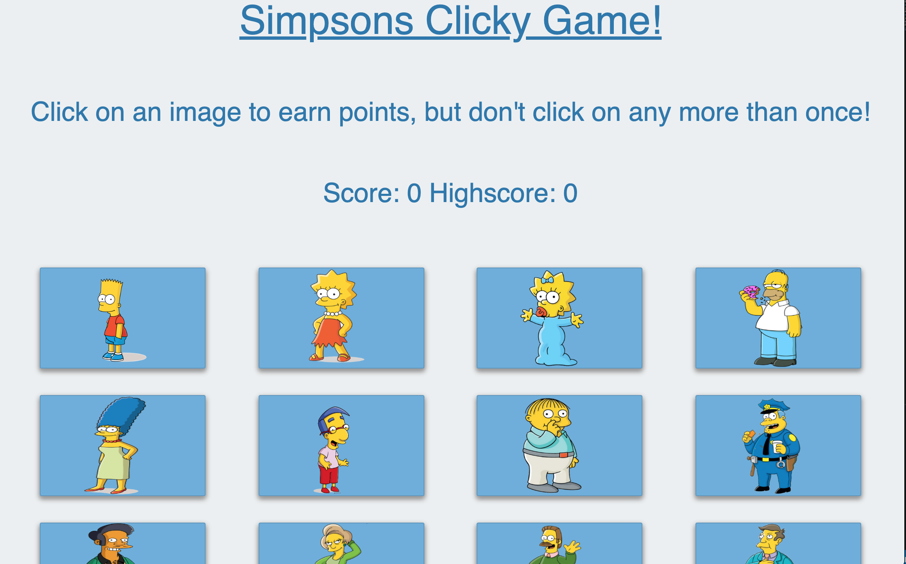

# The Simpsons Clicky Game
This project was completed during week 20 of Vanderbilt University's Coding Bootcamp. 

## Link

https://mmvogler.github.io/clickygame/

## How it Works

This application renders different Simpson characters to the screen. 
Every time an image is clicked, the images rendered to the page shuffle themselves in a random order. To gain points, users can't click the same image twice. The user's score is reset after an incorrect guess, then the game restarts.

## Screen Shot

## Technology Used

- React.js UI 
- Github Pages

### Future Goals

- More CSS/Bootstrap styling 

